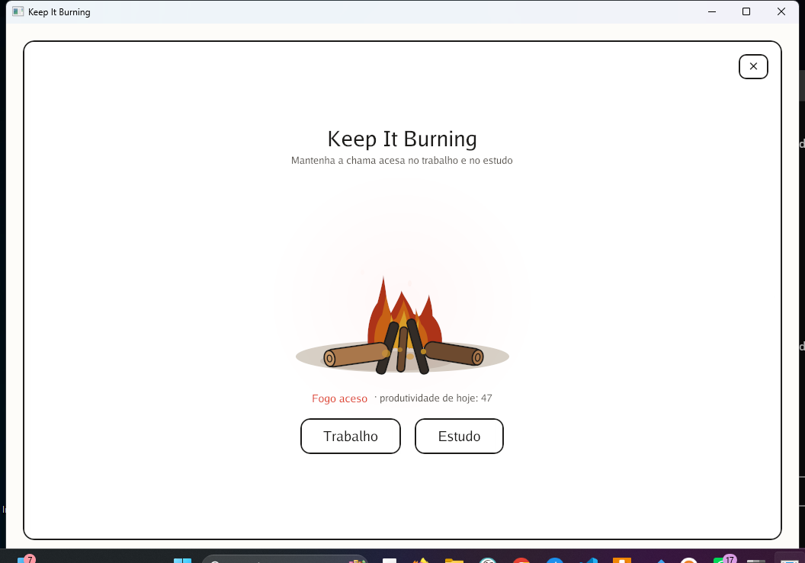
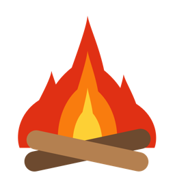
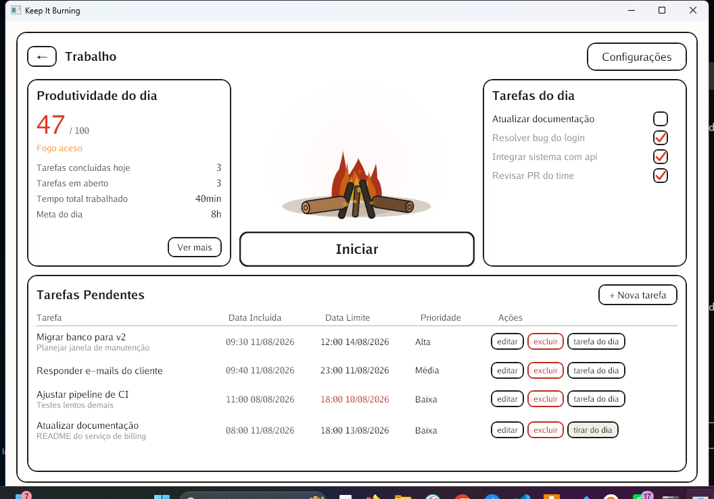
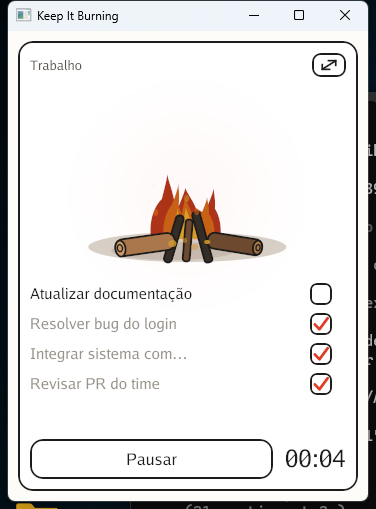
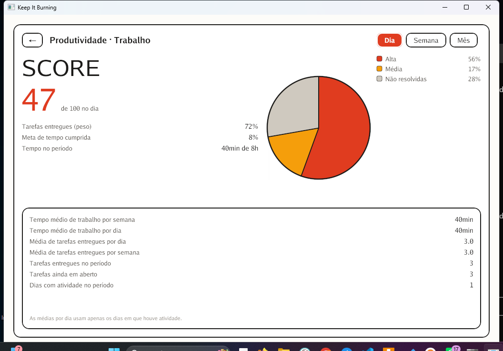
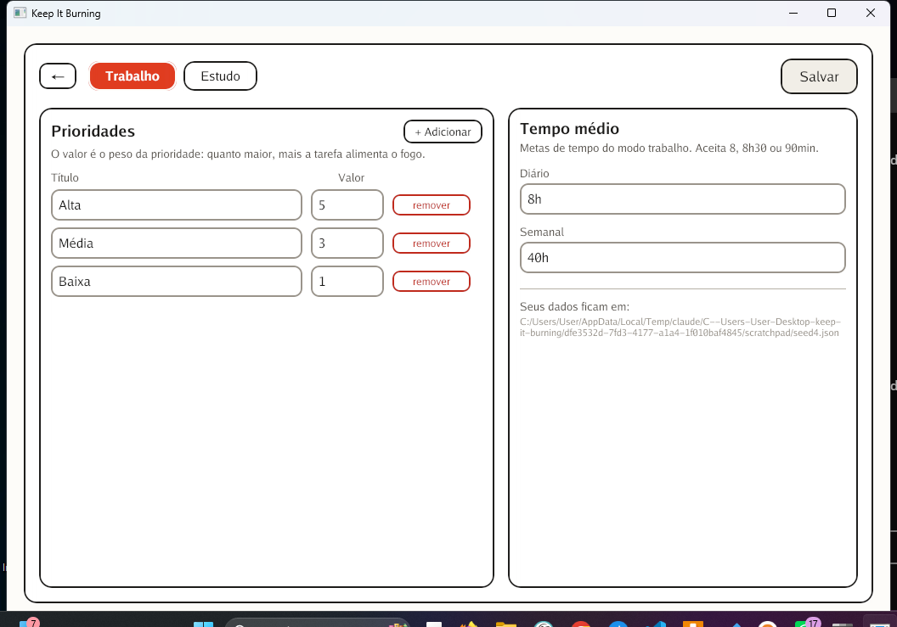
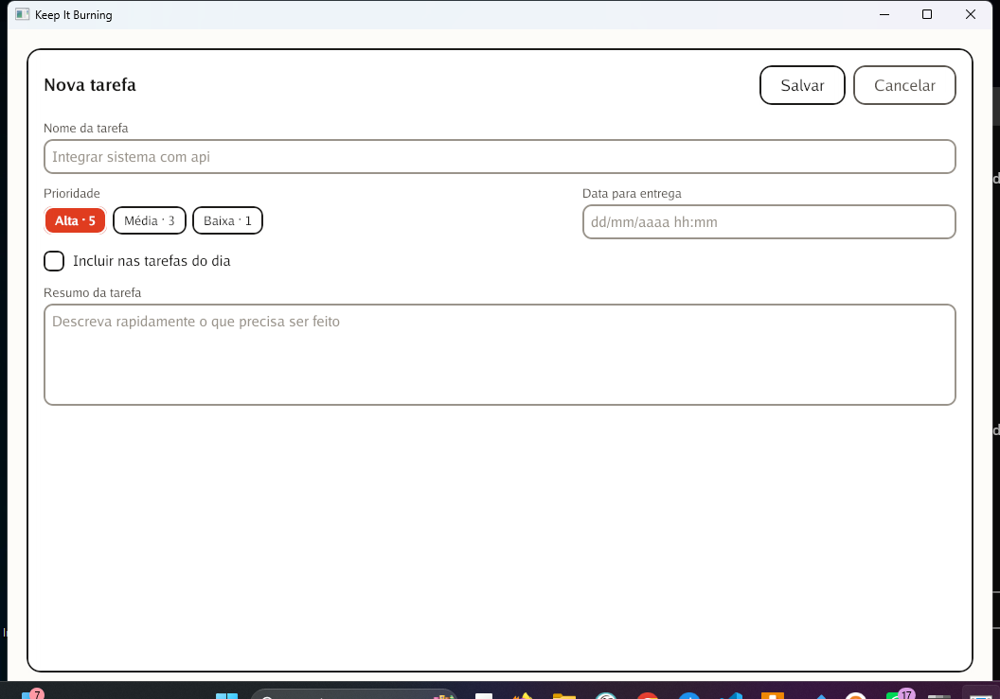

# Keep It Burning

Aplicativo de produtividade para Windows, escrito em Go, focado em **trabalho** e **estudo**.

A ideia é simples: a fogueira da tela principal é o seu dia. Quanto mais tarefas
importantes você entrega e mais perto fica da sua meta de tempo, mais alta a chama.
Um dia parado deixa a fogueira na brasa.



---

## Índice

- [Como funciona](#como-funciona)
- [Telas](#telas)
- [Instalação](#instalação)
  - [Opção 1 — compilar do código-fonte](#opção-1--compilar-do-código-fonte)
  - [Opção 2 — baixar o executável pronto](#opção-2--baixar-o-executável-pronto)
- [Como usar](#como-usar)
- [Como o score é calculado](#como-o-score-é-calculado)
- [Onde os dados ficam salvos](#onde-os-dados-ficam-salvos)
- [Desenvolvimento](#desenvolvimento)
- [Estrutura do projeto](#estrutura-do-projeto)
- [Solução de problemas](#solução-de-problemas)

---

## Como funciona

- **Dois modos independentes**: trabalho e estudo. Cada um tem as próprias tarefas,
  prioridades e metas de tempo.
- **Tarefas** com título, prioridade, dificuldade, categoria, subcategoria, data
  limite e resumo. Você marca as que vai fazer hoje como *tarefas do dia*.
- **Prioridades configuráveis**: você define o título e o **valor** (o peso) de cada
  uma. Uma tarefa "Alta" de peso 5 alimenta o fogo cinco vezes mais que uma "Baixa"
  de peso 1.
- **Dificuldades configuráveis**: o valor da dificuldade **multiplica** o peso da
  prioridade. Uma tarefa difícil entregue vale mais que uma fácil de mesma
  prioridade. Tarefa sem dificuldade usa o fator 1.
- **Categorias e subcategorias** configuráveis, independentes entre si. Elas não
  pesam no score: servem para filtrar a lista de tarefas e fatiar os relatórios.
- **Metas de tempo** diária e semanal, comparadas com o tempo realmente cronometrado.
- **Modo foco**: ao apertar *Iniciar*, a janela encolhe e fica só a fogueira, as
  tarefas do dia, o botão de pausa e o cronômetro.
- **Dashboard de produtividade** com score por dia, semana ou mês, gráfico de pizza
  das prioridades resolvidas e não resolvidas, e indicadores médios.

<p align="center">
  
</p>

---

## Telas

### Menu principal

Resumo do dia, a fogueira com a produtividade atual, as tarefas do dia e a lista
completa de tarefas pendentes.



### Modo foco

Depois de apertar *Iniciar*. A janela encolhe para não atrapalhar, e o cronômetro
conta o tempo trabalhado. O botão no canto superior direito volta ao tamanho cheio.



### Dashboard de produtividade

Score do período escolhido, divisão das prioridades no gráfico de pizza e as médias
de tempo e de entrega.



### Configuração

Prioridades e dificuldades (título e valor), categorias e subcategorias (título) e
metas de tempo médio, separadas por modo.



### Nova tarefa



---

## Instalação

### Pré-requisitos

- **Windows 10 ou 11** (64 bits)
- **[Go 1.21 ou superior](https://go.dev/dl/)** — só para compilar

> **Você não precisa instalar compilador C, MinGW nem nada além do Go.**
> O aplicativo usa [Gio](https://gioui.org), que no Windows é Go puro. É só clonar e
> compilar.

### Opção 1 — compilar do código-fonte

Abra o **PowerShell** ou o **Prompt de Comando** e rode:

```powershell
git clone https://github.com/dvet/keep-it-burning.git
cd keep-it-burning
go build -ldflags="-H windowsgui" -o KeepItBurning.exe .
```

Pronto. Vai aparecer o `KeepItBurning.exe` na pasta, já com o ícone da fogueira.
Dê dois cliques para abrir.

> **Para que serve o `-ldflags="-H windowsgui"`?**
> Ele evita que uma janela preta de terminal abra junto com o aplicativo.
> Se você quiser ver as mensagens de erro no terminal (útil para depurar),
> compile sem essa opção: `go build -o KeepItBurning.exe .`

#### Deixar acessível de qualquer lugar (opcional)

```powershell
go install github.com/dvet/keep-it-burning@latest
```

O executável vai para `%USERPROFILE%\go\bin`. Se essa pasta estiver no seu `PATH`,
basta digitar `keep-it-burning` em qualquer terminal.

### Opção 2 — baixar o executável pronto

Se houver uma release publicada, baixe o `.exe` em
[Releases](https://github.com/dvet/keep-it-burning/releases) e execute direto — não
precisa instalar nada.

> O Windows pode mostrar um aviso do SmartScreen na primeira execução, porque o
> executável não tem assinatura digital paga. Clique em **Mais informações** →
> **Executar assim mesmo**.

---

## Como usar

1. **Abra o app** e escolha **Trabalho** ou **Estudo**.
2. **Configure suas prioridades, dificuldades, categorias e metas** no botão
   *Configurações*, no canto
   superior direito. O padrão já vem com Alta (5), Média (3) e Baixa (1), 8h por dia
   e 40h por semana no modo trabalho.
3. **Crie tarefas** em *+ Nova tarefa*: nome, prioridade, dificuldade, categoria,
   subcategoria, data limite e um resumo.
4. **Marque as tarefas de hoje** com o botão *tarefa do dia* na lista de pendentes.
   Elas aparecem no painel da direita e no modo foco.
5. **Aperte *Iniciar***. A janela encolhe, o cronômetro começa a rodar e você
   trabalha. Vá marcando as tarefas conforme termina.
6. **Pause** quando parar (café, reunião, almoço). O tempo em pausa não conta.
7. **Volte ao tamanho cheio** pelo botão do canto superior direito. O tempo é gravado
   no histórico e o score se atualiza na hora.
8. **Acompanhe sua evolução** em *Ver mais*, alternando entre dia, semana e mês.

### Atalhos e detalhes úteis

- No formulário de tarefa, **Enter** no campo de nome salva direto.
- A **data limite** aceita `05/02/2026`, `05/02/2026 18:30` e também `2026-02-05`.
  Só a data, sem hora, vira o fim daquele dia (23:59).
- O **tempo médio** na configuração aceita `8`, `8h`, `8h30`, `8:30`, `7,5` e `90min`.
- Tarefas com o **prazo vencido** aparecem com a data em vermelho.
- Fechar o aplicativo **salva automaticamente** o tempo da sessão em andamento.

---

## Como o score é calculado

O score vai de **0 a 100** e combina duas coisas, porque nenhuma das duas sozinha
conta a história inteira: só tarefas premiaria quem fecha tarefas triviais, e só
tempo premiaria quem fica sentado na cadeira sem produzir.

```
score = 100 × ( 0,6 × entrega + 0,4 × tempo )

entrega = peso das tarefas entregues ÷ peso de todas as tarefas do período
tempo   = tempo cronometrado ÷ meta do período   (limitado a 1)
```

**O peso de cada tarefa é o valor da prioridade multiplicado pelo valor da
dificuldade**, os dois configurados por você. Entregar uma tarefa "Alta" de peso 5
vale o mesmo que entregar cinco tarefas "Baixa" de peso 1; e a mesma "Alta" marcada
como "Difícil" de fator 3 vale três vezes mais que ela marcada como "Fácil" de
fator 1. Tarefa sem dificuldade escolhida usa o fator 1, o neutro — por isso as
tarefas criadas antes do campo existir continuam pesando o que sempre pesaram.

Uma tarefa entra no período se foi **concluída dentro dele**; e conta como pendente
se está em aberto e é **cobrada nele** — seja porque o prazo cai dentro do período,
seja porque já venceu, seja porque você a marcou como tarefa do dia.

Se não houver nenhuma tarefa no período, o score passa a ser só o cumprimento da
meta de tempo. Passar da meta não gera score acima de 100.

### O score e o fogo

| Score | Fogueira |
|------:|----------|
| 0 – 19 | Quase apagando |
| 20 – 39 | Chama fraca |
| 40 – 64 | Fogo aceso |
| 65 – 84 | Fogo forte |
| 85 – 100 | Fogueira no talo |

A intensidade também controla, de forma contínua, a altura das chamas, quantas
línguas de fogo aparecem, a quantidade de fagulhas e o brilho ao redor.

Na **tela inicial** — onde você ainda não escolheu um modo — a fogueira mostra o
**maior** dos dois scores do dia. Quem só trabalha e não estuda não merece ver a
chama pela metade.

---

## Onde os dados ficam salvos

Tudo fica em um único arquivo JSON legível:

```
%AppData%\KeepItBurning\data.json
```

O caminho exato também aparece na tela de configuração. O arquivo é gravado de forma
atômica: se o computador desligar no meio da escrita, ou o arquivo antigo continua
inteiro, ou o novo está completo — nunca um meio-termo corrompido.

**Para fazer backup**, basta copiar esse arquivo. **Para migrar de máquina**, copie-o
para o mesmo lugar no computador novo.

Você também pode usar outro arquivo, útil para separar perfis ou testar:

```powershell
.\KeepItBurning.exe -data "D:\meus-dados\produtividade.json"
```

---

## Desenvolvimento

### Rodar sem compilar

```powershell
go run .
```

### Testes

Toda a lógica — score, prioridades, cronômetro, datas, persistência e validação de
formulários — é testada:

```powershell
go test ./...
```

Com detalhes de cada teste:

```powershell
go test ./... -v
```

Com relatório de cobertura:

```powershell
go test ./... -cover
```

> O detector de corrida (`go test -race`) exige um compilador C instalado. Sem ele,
> os testes rodam normalmente, só sem essa checagem extra.

### Verificações estáticas

```powershell
go vet ./...
gofmt -l .
```

### Ícone do aplicativo

O ícone é a mesma fogueira da interface, e é **desenhado por código** em
`tools/genicon` — não é uma imagem editada à mão. Assim ele continua igual ao app
se as cores da fogueira mudarem.

Os arquivos gerados já estão versionados, então **quem só quer compilar não precisa
fazer nada**: os `.syso` na raiz são linkados automaticamente pelo `go build`, e o
mesmo recurso serve para o ícone do executável, da janela e da barra de tarefas.

Para alterar o desenho, edite `tools/genicon/main.go` e regenere:

```powershell
go run ./tools/genicon -o icon.ico
go run github.com/akavel/rsrc@v0.10.2 -ico icon.ico -arch amd64 -o rsrc_windows_amd64.syso
go run github.com/akavel/rsrc@v0.10.2 -ico icon.ico -arch arm64 -o rsrc_windows_arm64.syso
```

Para conferir o resultado antes de embutir, gere também os PNGs de cada tamanho:

```powershell
go run ./tools/genicon -o icon.ico -png .\icones
```

---

## Estrutura do projeto

```
keep-it-burning/
├── main.go                      Ponto de entrada: abre a janela
├── icon.ico                     Ícone da fogueira, gerado por tools/genicon
├── rsrc_windows_amd64.syso      Recurso do Windows com o ícone (64 bits)
├── rsrc_windows_arm64.syso      O mesmo recurso para Windows ARM
├── tools/genicon/               Gerador do ícone
├── internal/
│   ├── model/                   Tarefas, prioridades, sessões e configurações
│   ├── productivity/            Score, gráfico de pizza, indicadores e o fogo
│   ├── timer/                   Cronômetro de trabalho/estudo
│   ├── store/                   Leitura e gravação do JSON
│   ├── dates/                   Fronteiras de dia, semana e mês
│   └── ui/                      Telas em Gio
│       ├── app.go               Estado do app e troca de telas
│       ├── theme.go             Cores, botões, campos e painéis
│       ├── fire.go              A fogueira animada
│       ├── piechart.go          Gráfico de pizza
│       ├── format.go            Datas, durações e porcentagens
│       └── screen_*.go          Uma tela por arquivo
└── docs/                        Imagens do README
```

A lógica de negócio não depende da interface: os pacotes `model`, `productivity`,
`timer`, `store` e `dates` são Go puro e podem ser testados sem abrir janela nenhuma.

---

## Solução de problemas

**A janela abre em branco ou o app fecha sozinho.**
Atualize o driver de vídeo. O Gio usa Direct3D 11 ou OpenGL, e drivers muito antigos
podem falhar. Para ver a mensagem de erro, compile sem `-ldflags="-H windowsgui"` e
rode pelo terminal.

**`go: command not found` ou `go não é reconhecido`.**
O Go não está instalado ou não está no `PATH`. Instale em
[go.dev/dl](https://go.dev/dl/) e **feche e abra o terminal** depois.

**O SmartScreen bloqueia o executável.**
É esperado em executáveis sem assinatura digital. Clique em **Mais informações** →
**Executar assim mesmo**.

**Perdi minhas tarefas.**
Verifique se o arquivo `%AppData%\KeepItBurning\data.json` existe. Se você iniciou o
app com a opção `-data`, os dados estão no caminho que você passou.

**O score não sobe mesmo eu trabalhando.**
O tempo só conta quando o cronômetro está rodando no modo foco. Confira também se a
meta de tempo na configuração não está alta demais para a sua rotina.

---

## Licença

MIT.
